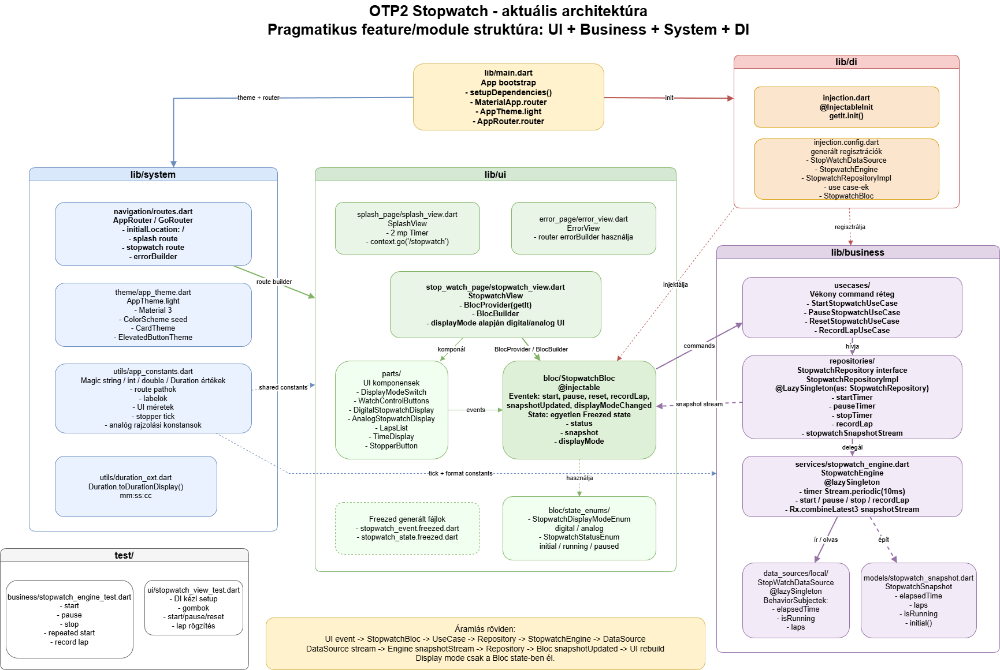

# OTP Stopwatch

Az **OTP Stopwatch** egy Flutter alapú stopper alkalmazás, amely a célja szerint egyszerű funkciót valósít meg, de közben átlátható, pragmatikus rétegezett architektúrát használ.

Az app jelenleg splash képernyővel indul, majd egy stopper nézetre navigál. A stopper indítható, szüneteltethető, nullázható, lap időket tud rögzíteni, valamint digitális és analóg kijelző között váltható.

## Fő funkciók

- Stopwatch indítás, szüneteltetés és reset.
- Lap idők rögzítése és listázása.
- Digitális stopper kijelző.
- Analóg stopper kijelző `CustomPainter` alapú rajzolással.
- Digitális/analóg nézetváltás switch-csel.
- Splash oldal késleltetett navigációval.
- Router szintű error oldal.
- Material 3 alapú saját theme.
- `get_it` + `injectable` alapú dependency injection.
- `flutter_bloc` + `freezed` alapú UI state management.

## Architektúra

A projekt egy pragmatikus feature/module alapú struktúrát követ. A cél nem a túlzottan szigorú clean architecture, hanem az átlátható felelősségi körök megtartása.

```text
lib/
  main.dart
  di/
  system/
    navigation/
    theme/
    utils/
  business/
    data_sources/
    models/
    repositories/
    services/
    usecases/
    utils/
  ui/
    splash_page/
    error_page/
    stop_watch_page/
      bloc/
      parts/
      stopwatch_view.dart
```

### Rétegek röviden

- `ui`: képernyők, widgetek és Bloc.
- `business`: stopwatch üzleti logika, engine, repository, use case-ek és modellek.
- `system`: router, theme és közös konstansok.
- `di`: dependency injection konfiguráció.

A fő adatáramlás:

```text
UI event
  -> StopwatchBloc
  -> UseCase
  -> StopwatchRepository
  -> StopwatchEngine
  -> StopWatchDataSource
  -> snapshot stream
  -> StopwatchBloc
  -> UI rebuild
```

Az aktuális architektúra:



A draw.io forrás fájl:

[docs/latest_architecture.drawio](docs/latest_architecture.drawio)

A kódbázis reprodukciós leírása:

[docs/instructions.md](docs/instructions.md)

## Stopwatch state

A stopper egyetlen Freezed state-et használ:

- `status`
- `snapshot`
- `displayMode`

A `snapshot` tartalmazza az elapsed time, laps és isRunning értékeket. 
A `displayMode` csak a Bloc state része, nem része a business modellnek.

## Fő függőségek

- `flutter_bloc`
- `freezed`
- `get_it`
- `injectable`
- `go_router`
- `rxdart`

## Projekt indítása

Függőségek telepítése:

```bash
flutter pub get
```

Generált fájlok előállítása:

```bash
dart run build_runner build --delete-conflicting-outputs
```

Alkalmazás futtatása:

```bash
flutter run
```

## Tesztek

A projektben business és widget tesztek is találhatók.

```bash
flutter test
```

Fő tesztelt területek:

- `StopwatchEngine` indítás, pause, reset és lap rögzítés.
- Többszöri start hívás kezelése.
- Stopwatch UI gombok és látható idő frissülése.
- Lap lista megjelenítése.

## Fejlesztői megjegyzések

- A projekten belüli importok abszolút `package:otp2/...` formát használnak.
- A data source csak állapottárolásért felel.
- A timer logika a `StopwatchEngine`-ben található.
- A repository vékony adapter az engine felé.
- A use case-ek jelenleg vékonyak, megtartják a business réteg tiszta belépési pontjait.
